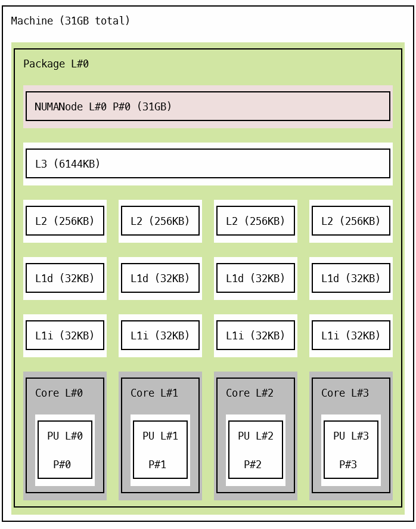
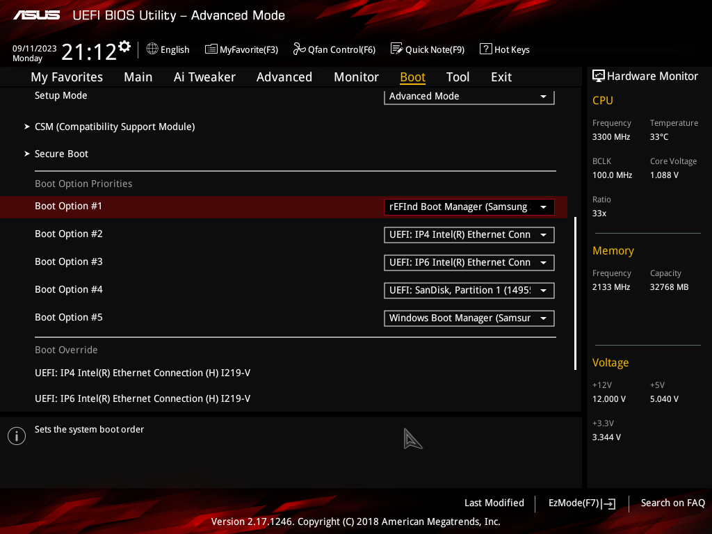
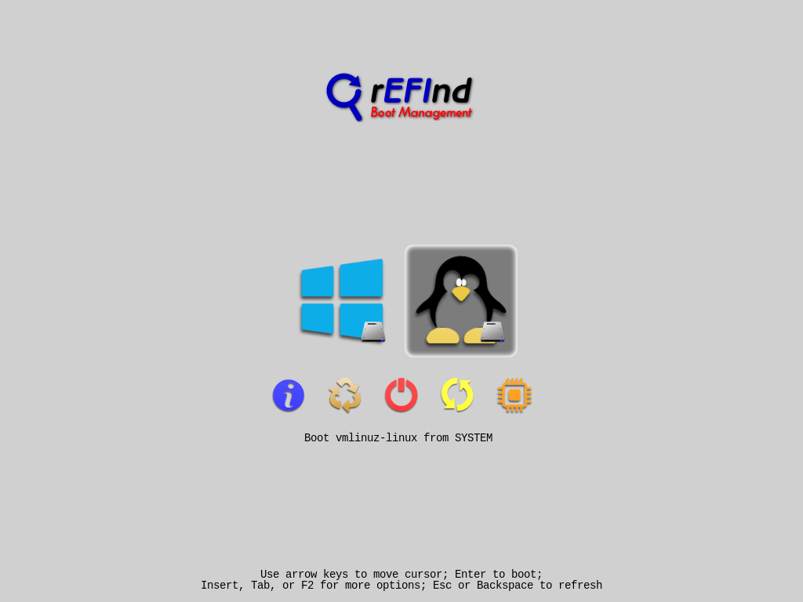

# Домашняя работа 1

## 1. Процессор

1. **Модель процессора:** Intel(R) Core(TM) i5-6600 CPU;
2. **Архитектура:** x86_64;
3. **Микроархитектура:** Skylake;
4. **Кодовое имя микроархитектуры:** Skylake;
5. **Расширенные наборы инструкций:** fpu vme de pse tsc msr pae mce cx8 apic sep mtrr pge mca cmov pat pse36 clflush
   dts acpi mmx fxsr sse sse2 ss ht tm pbe syscall nx pdpe1gb rdtscp lm constant_tsc art arch_perfmon pebs bts rep_good
   nopl xtopology nonstop_tsc cpuid aperfmperf pni pclmulqdq dtes64 monitor ds_cpl vmx smx est tm2 ssse3 sdbg fma cx16
   xtpr pdcm pcid sse4_1 sse4_2 x2apic movbe popcnt tsc_deadline_timer aes xsave avx f16c rdrand lahf_lm abm
   3dnowprefetch cpuid_fault invpcid_single pti ibrs ibpb stibp tpr_shadow flexpriority ept vpid ept_ad fsgsbase
   tsc_adjust bmi1 hle avx2 smep bmi2 erms invpcid rtm mpx rdseed adx smap clflushopt intel_pt xsaveopt xsavec xgetbv1
   xsaves dtherm ida arat pln pts hwp hwp_notify hwp_act_window hwp_epp vnmi;
6. **Число ядер:** 4;
7. **Число потоков, обрабатываемых на кристалле: 4**;
8. **Размер кэш-памяти всех уровней:**
    1. L1: 256 KiB;
    2. L2: 1 MiB;
    3. L3: 6 MiB;
9. **Связность кэш-памяти последнего уровня (общая/не общая для какого числа ядер):** общая;
10. **Диаграмма всех уровней кэш-памяти (пакет hwloc):**



## 2. Дистрибутив

```
[Reversean@Reversean ~]$ neofetch
                   -`                    Reversean@Reversean
                  .o+`                   -------------------
                 `ooo/                   OS: Arch Linux x86_64
                `+oooo:                  Kernel: 6.4.12-arch1-1
               `+oooooo:                 Uptime: 14 mins
               -+oooooo+:                Packages: 197 (pacman)
             `/:-:++oooo+:               Shell: bash 5.1.16
            `/++++/+++++++:              Resolution: 1024x768
           `/++++++++++++++:             Terminal: /dev/pts/0
          `/+++ooooooooooooo/`           CPU: Intel i5-6600 (4) @ 3.900GHz
         ./ooosssso++osssssso+`          GPU: NVIDIA GeForce RTX 4070 Ti
        .oossssso-````/ossssss+`         Memory: 178MiB / 32040MiB
       -osssssso.      :ssssssso.
      :osssssss/        osssso+++.
     /ossssssss/        +ssssooo/-
   `/ossssso+/:-        -:/+osssso+-
  `+sso+:-`                 `.-/+oso:
 `++:.                           `-/+/
 .`                                 `/
```

## 3. Используемый менеджер окон

В качестве менеджера окон был выбран KWin из проекта KDE (версия KDE Plasma: 5.27.7). 


## 4. Установка Arch Linux

В качестве ОС для работы был выбран дистрибутив Arch Linux, релиз от 2023.09.01. Установщик дистрибутива был монтирован
на флешку, после чего был запущен.

На самом деле Arch не установщика как такового, а для установки используется образ с инструментами для ручной установки,
а потому весь процесс установки, включая создание разделов монтирование ..., контролируется пользователем.

Т.к. на рабочем устройстве уже была установлена ОС Windows 10 и доступ к ней нужно было сохранить было решено настроить
Dual Booting, для возможности выбора запуска между двумя установленными операционными системами.

Для загрузки операционных систем используется UEFI. Ну и по скольку Windows уже была установлена, на всех дисках
для управления разделами используются таблицы типа GPT. Эта информация нужна для определения необходимых требований к
перечню разделов, а также ее нужно учитывать при конфигурации Dual Booting.

### Настройка разделов диска

Предварительно на одном из дисков было выделено 100 GB свободного места для дальнейшего создания раздела под Arch.

Посмотреть подключенные диски и содержащиеся в них разделы можно при помощи утилиты `lsblk`:

```
root@archiso ~ # lsblk
NAME        MAJ:MIN RM   SIZE RO TYPE MOUNTPOINTS
loop0         7:0    0 682.6M  1 loop /run/archiso/airootfs
sda           8:0    0 465.8G  0 disk
├─sda1        8:1    0    16M  0 part
└─sda2        8:2    0 365.7G  0 part
sdb           8:16   0 931.5G  0 disk
├─sdb1        8:17   0   128M  0 part
└─sdb2        8:18   0 931.4G  0 part
sdc           8:32   1  14.6G  0 disk
└─sdc4        8:36   1  14.6G  0 part
nvme0n1     259:0    0 465.8G  0 disk
├─nvme0n1p1 259:1    0   100M  0 part
├─nvme0n1p2 259:2    0    16M  0 part
├─nvme0n1p3 259:3    0 465.1G  0 part
└─nvme0n1p4 259:4    0   516M  0 part
```

Для установки Arch с использованием UEFI/GPT рекомендуется выделить 3 раздела:

- `/efi` – раздел для загрузки операционной системы (нужен загрузчику UEFI)
- [SWAP] – раздел виртуальной памяти
- `/` – раздел с корневой папкой файловой системы

Раздел `/efi` был создан ранее автоматически установщиком Windows (раздел `nvme0n1p1`), и его можно переиспользовать для
настройки Dual Booting.

Раздел виртуальной памяти можно заменить настройкой файла подкачки. Это более гибкое решение, т.к. файлами управлять
удобнее, чем разделами.

Для основной файловой системы был использован диск `sda`, в котором было выделено свободное место.

Для настройки разделов была использована утилита `cfdisk`, предоставляющая TUI для управления разделами дисков.

```
root@archiso ~ # lsblk
NAME        MAJ:MIN RM   SIZE RO TYPE MOUNTPOINTS
loop0         7:0    0 682.6M  1 loop /run/archiso/airootfs
sda           8:0    0 465.8G  0 disk
├─sda1        8:1    0    16M  0 part
├─sda2        8:2    0 365.7G  0 part
└─sda3        8:3    0   100G  0 part
sdb           8:16   0 931.5G  0 disk
├─sdb1        8:17   0   128M  0 part
└─sdb2        8:18   0 931.4G  0 part
sdc           8:32   1  14.6G  0 disk
└─sdc4        8:36   1  14.6G  0 part
nvme0n1     259:0    0 465.8G  0 disk
├─nvme0n1p1 259:5    0   100M  0 part
├─nvme0n1p2 259:6    0    16M  0 part
├─nvme0n1p3 259:7    0 465.1G  0 part
└─nvme0n1p4 259:8    0   516M  0 part
```

Был создан раздел `sda3`, который нужно отформатировать в определенной файловой системе (в моем случае была использована
стандартная для ОС Linux файловая система ext4):

```shell
mkfs.ext4 /dev/sda3
```

```
root@archiso ~ # mkfs.ext4 /dev/sda3
mke2fs 1.47.0 (5-Feb-2023)
Discarding device blocks: done
Creating filesystem with 26214400 4k blocks and 6566400 inodes
Filesystem UUID: 5759b9d3-ed39-41a9-9d56-871441217f9a
Superblock backups stored on blocks:
        32768, 98304, 163840, 229376, 294912, 819200, 884736, 1605632, 2654208,
        4096000, 7962624, 11239424, 20480000, 23887872

Allocating group tables: done
Writing inode tables: done
Creating journal (131072 blocks): done
Writing superblocks and filesystem accounting information: done
```

Далее требовалось смонтировать корневую директорию в созданный и отформатированный для этого раздел:

```shell
mount /dev/sda3 /mnt
```

Также нужно смонтировать раздел с загрузчиком:

```shell
mount /dev/nvme0n1p1 /mnt/boot
```

### Установка

Перед установкой нужно скачать набор пакетов для установки, ядро Linux, набор стандартных драйверов и утилиты на выбор
(например nano и vim для редактирования текстовых файлов, kea, dhcpcd и networkmanager для настройки подключения к сети,
а также sudo и git). Делается это все при помощи утилиты `pacstrap`, созданной специально для скачивания и установки
нужных инструментов в ранее смонтированную точку:

```shell
pacstrap -K /mnt base linux linux-firmware nano vim kea dhcpcd networkmanager sudo git
```

Тут возникла проблема: официальная вики Arch говорит, что для раздела boot нужно минимум 300 МБ, и не просто так, ведь
раздела, созданного установщиком Windows не хватает для загрузчика дра Linux, поэтому пришлось изрядно помучиться с тем,
чтобы перераспределить место на диске таким образом, чтобы выделить раздел для загрузчика размером в 1 ГБ (чтобы
наверняка). Сложности в основном доставило то, что нераспределенного места не было, а потому, чтобы обойтись без потери
данных, все манипуляции с диском пришлось делать через менеджер дисков Windows и утилиты Diskpart, которые еще и не
сразу стали работать, выкидывая ошибки, связанные с как-то с ошибками диска.

В общем после разбиения таблица разделов выглядит следующим образом:

```
root@archiso ~ # lsblk
NAME        MAJ:MIN RM   SIZE RO TYPE MOUNTPOINTS
loop0         7:0    0 682.6M  1 loop /run/archiso/airootfs
sda           8:0    0 465.8G  0 disk
├─sda1        8:1    0    16M  0 part
├─sda2        8:2    0 365.7G  0 part
└─sda3        8:3    0   100G  0 part /mnt
sdb           8:16   0 931.5G  0 disk
├─sdb1        8:17   0   128M  0 part
└─sdb2        8:18   0 931.4G  0 part
sdc           8:32   1  14.6G  0 disk
└─sdc4        8:36   1  14.6G  0 part
nvme0n1     259:0    0 465.8G  0 disk
├─nvme0n1p1 259:1    0    16M  0 part
├─nvme0n1p2 259:2    0 464.1G  0 part
├─nvme0n1p3 259:3    0     1G  0 part /mnt/boot
└─nvme0n1p4 259:4    0   516M  0 part
```

Генерация fstab-файла с информацией о файловой системе смонтированного раздела:

```shell
genfstab -U /mnt >> /mnt/etc/fstab
```

```
# Static information about the filesystems.
# See fstab(5) for details.

# <file system> <dir> <type> <options> <dump> <pass>
# /dev/sda3
UUID=5759b9d3-ed39-41a9-9d56-871441217f9a       /               ext4            rw,relatime     0 1
```

Далее переход в корень смонтированной системы для более детальной настройки ОС:

```shell
arch-chroot /mnt
```

Установка временной зоны:

```shell
ln -sf /usr/share/zoneinfo/Europe/Moscow /etc/localtime
hwclock --systohc
```

Для конфигурирования локализации в файле `/etc/locale.gen` сначала были разкоментированы локали `en_EN.UTF-8` и
`ru_RU.UTF-8`. Был создан файл `/etc/locale.gen`, в котором была указана основная локаль `LANG=ru_RU.UTF-8`. Также
для корректного отображения кириллицы в консоли и возможности переключения русской раскладки клавиатуры, в файл
`/etc/vconsole.conf` прописано следующее:

```
FONT=cyr-sun16
KEYMAP=ru
```

Для генерации локалей использовалась команда:

```shell
locale-gen
```

Далее было задано имя хоста в файле `/etc/hostname`.

### Установка boot-loader

Т.к. требуется dual-boot, требуется сохранить в разделе EFI загрузчик Windows и при этом сконфигурировать новый
загрузчик, который бы подхватил и Windows и Linux. Для этих целей сгодился бы и Grub, однако предпочтение было сделано
в сторону rEFInd из-за его простоты. Действительно, его установка выполняется всего в 2 команды:

```shell
refind-install
mkrlconf
```

При этом он без лишних настроек смог найти как загрузчик Windows, так и Linux.

### Завершение

Выходим из смонтированной ОС, размонтируем ее и загрузчик и перезагружаем:

```shell
exit
umount -a
reboot
```

И rEFInd появился в меню последовательности загрузки биос без всяких проблем:



Сам rEFInd также работает без проблем, позволяет запускать как Windows, так и установленный Arch:


