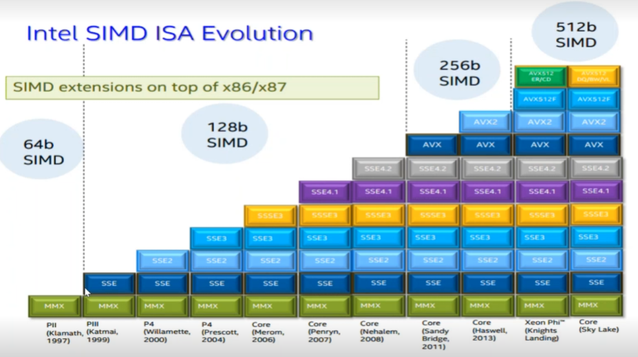
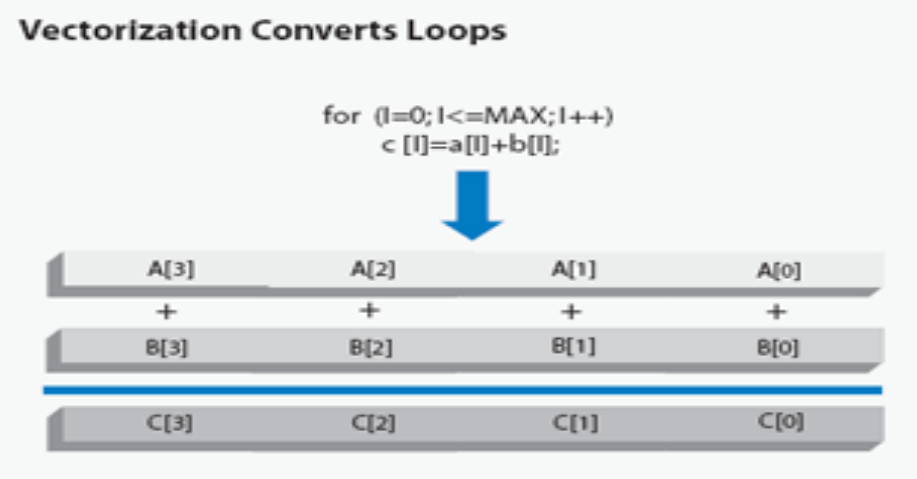

# Лекция 3

## Показатели качества кода

### Пользовательские метрики

Производительность кода (Perf); 1/T (T - время работы участка кода); количественный показатель.

Потребляемая память (Mem); количественный показатель.

Поддержка современных микроархитектур; качественный показатель.

### Метрики разработчика

Сложность кода (Compl); можно измерять число строк кода (LOC) или цикломатическую сложность (Cycl).

Цикломатическая сложность - количество независимых трасс в программе.

### Эффективность кода

Является интегральным показателем; относится и к пользователю и разработчику.

Измеряется как $Perf / Compl = 1 / (T * Compl)$.

В знаменатель можно добавить метрику

- Mem
- время выхода на рынок (time to market)
- стоимость разработки

Высоко-эффективные технологии - технологии, направленные на повышение эффективности кода, а не только его
производительность.

Примеры:

- Fortran 2018 (ISO)
- Chapel (Cray)
- X10 (IBM)

## Эффективность процессора

- Производительность Perf (perfomance)
- Рассеиваемая мощность TDP (Thermal design power)
- Эффективность Prod (productivity)

Prod = Perf / TDP

В знаменатель можно добавлять:

- стоимость
- оказание влияние на окружающую среду при разработке и эксплуатации

## Эволюция архитектур

Тенденции:

- Опыт векторных процессоров
- Размер расширенных регистров

### Single core

Процессоры стали со временем векторными (ядро обладает АЛУ и FPU)

### Hyperthreading

Гиперпоточность - технология Intel для повышения производительности процессоров.

В процессоре, поддерживающем гиперпоточность, вычислительное ядро может хранить состояние сразу двух потоков выполнения,
содержит по 2 набора регистров. При выполнении задачи и возникновения кэш-промаха (нужно прочитать данные), ядро
переключается на выполнение другой задачи, переключившись на другой набор регистров.

### Dual core

Размещение 2х на кристале одного устройства.

### Multi core

Ядер на кристалле стало больше.

### Many core

Ядра теперь могут быть специализированным (могут специализировать на выполнении особого алгоритма, например H.264)

## Расширенные наборы инструкций

Компилятор может задействовать дополнительные наборы функций в зависимости от их наличия.

### MMX

- 64 бита
- lfpp (Itanium): 64 бита — 2 числа с плавающей запятой
- поддерживающие процессоры:
    - семейство Intel Pentium 5 (MMX)

### 3DNow!

- 64 бита — 2 числа с плавающей запятой
- поддержка кэша 3 уровня
- Поддерживающие процессоры:
    - семейства AMD K6-2, K6-3 (3DNow!)
    - National Semiconductor Geode (позже AMD Geode)
    - семейства VIA C3 (Cyrix III) "Samuel", "Samuel 2" "Ezra", "Eden ESP"
    - IDT Winchip 2

### SSE

- 64 бита — 2 числа с плавающей запятой
- Поддерживающие процессоры:
    - семейства Pentium 6

### SSE2

- 64 бита — 2 числа с плавающей запятой
- Поддерживающие процессоры:
    - Intel NetBurst-based CPUs (Pentium 4, Xeon, Celeron, Pentium D, Celeron D)
    - Intel Pentium M and Celeron M
    - Intel Atom
    - Transmeta Efficeon
    - VIA C7

### SSE3

- 64 бита — 2 числа с плавающей запятой
- Поддерживающие процессоры:
    - AMD:
        - Athlon 64, 64 X2, 64 FX, II
        - Opteron, Sempron
        - Phenom, Phenom II
        - Turion 64, 64 X2, X2 Ultra, II X2 Mobile, II X2 Ultra
        - APU
        - FX Series
    - Intel:
        - Celeron D, Celeron
        - Pentium 4, D, Extreme Edition, Dual-Core
        - Core
        - Xeon
        - Atom
    - VIA/Centaur:
        - C7
        - Nano
        - Transmeta Efficeon TM88xx (NOT Model Numbers TM86xx)

### SSE4

- 128 бит — 4 числа с плавающей запятой
- Поддерживающие процессоры:
    - Intel
        - Penryn, Nehalem, Silvermont
        - Haswell
    - AMD
        - Barcelona
        - Bulldozer
        - Bobcat
        - Jaguar
    - VIA
        - Nano

### AVX

- 256 бит — 8 чисел с плавающей запятой
- Поддерживающие процессоры:
    - Intel
        - Sandy Bridge, E
        - Ivy Bridge, E
        - Haswell, E
        - Broadwell, E
    - AMD:
        - Bulldozer
        - Piledriver
        - Steamroller
        - Excavator
        - Jaguar
        - Puma

### AVX2

- 256 бит — 8 чисел с плавающей запятой
- Поддерживающие процессоры:
    - Intel
        - Haswell (Q2 2013), E (Q3 2014)
        - Broadwell (Q4 2014), Broadwell E (2015)
        - Skylake (2015)
        - Cannonlake (2017)
    - AMD
        - Excavator (2015)

### AVX-512

- 512 бит — 16 чисел с плавающей запятой
- Поддерживающие процессоры:
    - Intel
        - Knights Landing Xeon Phi (2015)
        - Skylake Xeon (2016)
        - Cannonlake Xeon (2017)

## Векторизация

Ранее ранее использовалась архитектура SISD (Single Instruction, Single Data), подразумевающая выполнения процессором
одного потока команд.

Для повышения производительности в ядра стали вводить векторные АЛУ и векторные вычислители с плавающей запятой (FPU).

Данная архитектура стала называться SIMD (Single Instruction, Multiple Data), соответственно архитектура процессоров с
множеством ядер такой архитектуры стали называться MIMD (Multiple Instruction, Multiple Data).

Если увеличить регистровый файл, а на кристалле есть векторное АЛУ/FPU, на вход можно передавать несколько входов, что
позволит выполнять одну и ту же операцию над множеством данных. Это есть SIMD/векторизация.

Векторизация позволяет увеличить производительность без увеличения частоты процессора.

Пример:

Компилятор задействуется все 4 арифметико-логические устройства процессора, складывая не отдельные значения, а векторы
значений. При скалярном коде пришлось бы делать 4 операции сложения последовательно.

Перед векторизацией выстраиваются данные (marshaling) с целью сделать оба операнда векторными. Затем задействуется
векторное АЛУ/FPU. Результат помещается в векторный регистр, откуда попадает в оперативную память.

Векторизацию невозможно применить к операциям, если результат одной операции зависит от результата другой.

Компилятор может векторизовать код, указав

- 3 уровень оптимизации
- целевую платформу

### Перекрытие кода

В C++ есть псевдонимы, которые позволяют указывать на другие объекты (например элементы массива). Если переменные имеют
общие данные, это называется перекрытие по данным (memory overlapping).

Модификатор `restrict` означает, что разработчиком гарантируется перекрытие по памяти. Может вызывать ошибки, если
забыть учесть подобные моменты.

Для гарантии эксклюзивности данных можно использовать умные указатели (`auto`, `unique`).

Также компилятор может делать 2 версии участка кода: с без векторизации и с векторизацией. На первой он проверяет, может
ли быть перекрытие по данным.
