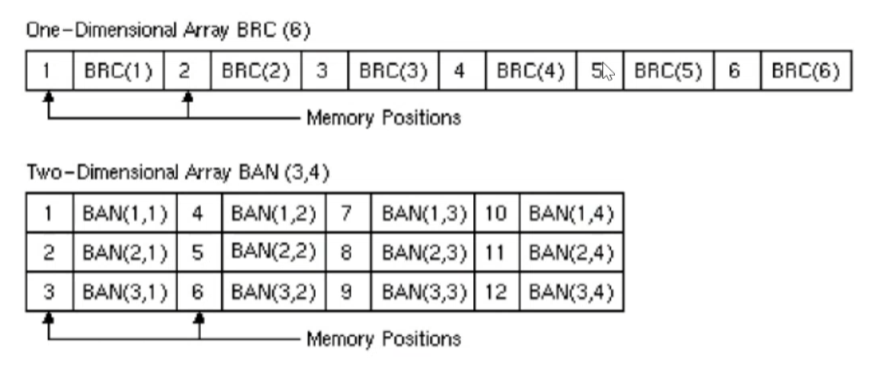
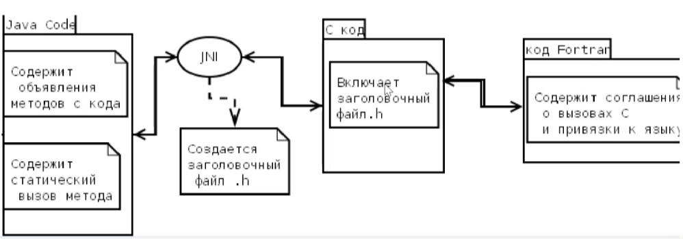

# Лекция 7

### Способы вызова процедур из головной диаграммы

#### Управляемый код

Управляемый код является архитектурно независимым, выполняется он под управлением среды (виртуальная машина).

Примеры:

- Common Language Runtime Environment (CLR), среда выполнения языка .NET
- Java Virtual Machine байт-код
- Виртуальная машина Dalvik

#### Неуправляемый код

Неуправляемый код (native) является архитектурно зависимым, компилируется под определенную систему.

### Оформление кода для запуска символов

- Скомпилированные объектные файлы (`.obj`) и статические библиотеки (`.lib`)
    - Преимущества:
        - Наибольшая производительность
        - Простота использования в IDE
    - Недостатки:
        - должны быть совместимы на этапе компоновки
        - не должны иметь имена, конфликтующие с именами стандартных библиотек
- Динамически подключаемая библиотека (.dll)
    - Преимущества:
        - Эффективность собственного кода
        - Доступность в большинстве языков
        - Обычно не создают конфликтов со стандартными библиотеками
    - Недостатки:
        - Использование в некоторых языках осложнено
- Сборка управляемого кода .NET
    - Преимущества:
        - теоретически архитектурно независимая среда реального времени
        - может вызывать неуправляемый код внутри DLL
    - Недостатки:
        - производительность сборки намного ниже
        - ограниченный набор языков
        - более сложный интерфейс при вызове неуправляемого кода

### Эквиваленты языков при обращении к процедурам

| Язык      | Вызов с возвращаемым значением | Вызов без возвращаемого значения |
|-----------|--------------------------------|----------------------------------|
| Fortran   | Function                       | Subroutine                       |
| C         | Function                       | void function                    |
| C++       | Function                       | void function                    |
| C#        | Function                       | void function                    |
| Basic     | Function                       | Sub                              |
| Pascal    | Function                       | Procedure                        |
| Delphi    | Function                       | Procedure                        |
| Assembler | Procedure                      | Procedure                        |

### Начальное значение индекса массива

| Язык              | По умолчанию | Может быть |
|-------------------|--------------|------------|
| C                 | 0            | 0          |
| C++               | 0            | 0          |
| C#                | 0            | 0          |
| Visual Basic .NET | 0            | 0          |
| JavaScript        | 0            | 0          |
| Visual Basic 6.0  | 0            | Any        |
| Fortran           | 1            | Any        |
| Pascal            | 1            | Any        |
| Delphi            | 1            | Any        |

### Развертывание массивов в памяти

| Язык              | Порядок     |
|-------------------|-------------|
| C                 | По строкам  |
| C++               | По строкам  |
| C#                | По строкам  |
| Visual Basic .NET | По строкам  |
| JavaScript        | По строкам  |
| Visual Basic 6.0  | По столбцам |
| VBScript          | По столбцам |
| Fortran           | По столбцам |
| Pascal            | По строкам  |
| Delphi            | По строкам  |

### Развертывание массивов по столбцам

### JNI

JNI позволяет использовать C++ нативный код в Java-коде

Соотношение типов:

| Собственный тип | Тип Java | Описание         |
|-----------------|----------|------------------|
| unsigned char   | jboolean | unsigned 8 bits  |
| signed char     | jbyte    | signed 8 bits    |
| unsigned short  | jchar    | unsigned 16 bits |
| short           | jshort   | signed 16 bits   |
| long            | jint     | signed 32 bits   |
| long long_int64 | jlong    | signed 64 bits   |
| float           | jfloat   | 32 bits          |
| double          | jdouble  | 64 bits          |
| void            |          |                  |

Ошибки в JNI могут сильно дестабилизировать виртуальную машину.

При использовании нативных библиотек пропадает кроссплатформенность.

Garbage Collector не работает с другими языковыми технологиями.

### Межязыковое взаимодействие на основе JNA

Позволяет ПО на Java вызывать собственные динамические библиотеки без использования JNI. При этом доступ к ним
осуществляется с минимальными затратами.

JNA не требует шаблонного или вспомогательного кода.

Под капотом используется библиотека foreign function interface library (libffi) для динамического вызова собственных
методов.

У JNI (как и у JNA) есть недостаток: при вызове символа из C-кода потребуется привязка при помощи заголовочного файла,
которые требуется писать вручную для компилятора.

### Методика межъязыкового взаимодействия на основе GIR

GIR - сканер, анализирующий код, и представляющий подробное описание всех символов, а также документирует их. Позволяет
автоматически создавать привязки.

ОДнако данный метод подразумевает некоторые сложности:

- Требуется написание исходного кода в терминах GObject C, что приводит к увеличению объема исходного кода
- Изменение библиотек вызывает последующее изменение привязок
- Ручная работа может генерировать больше ошибок

### Методика межъязыкового взаимодействия на основе VALA

