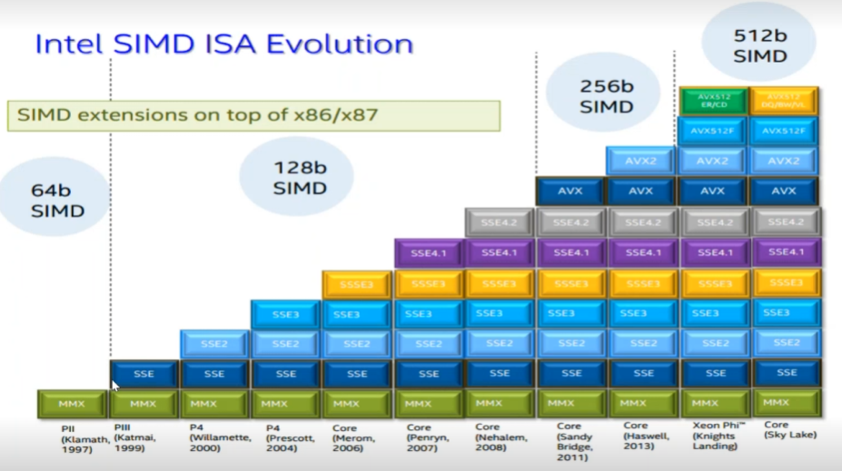
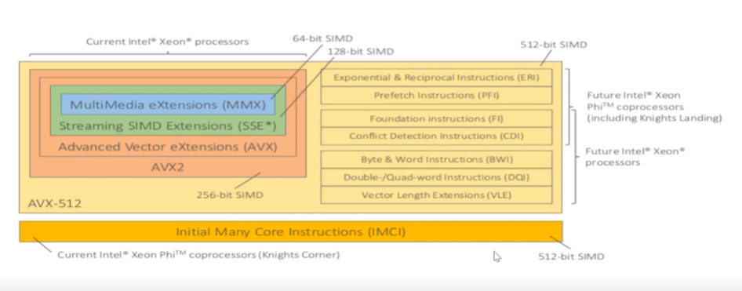
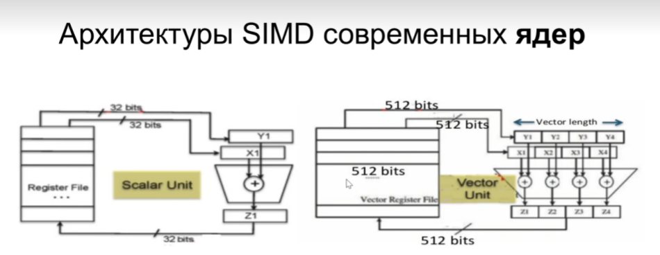
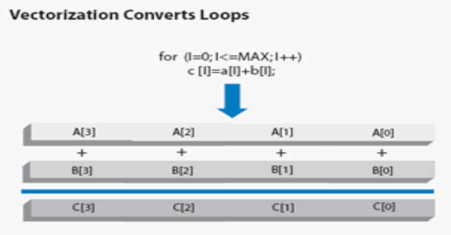
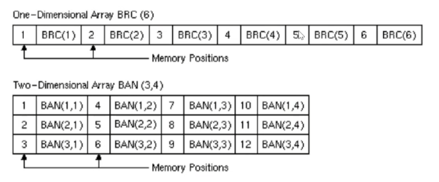
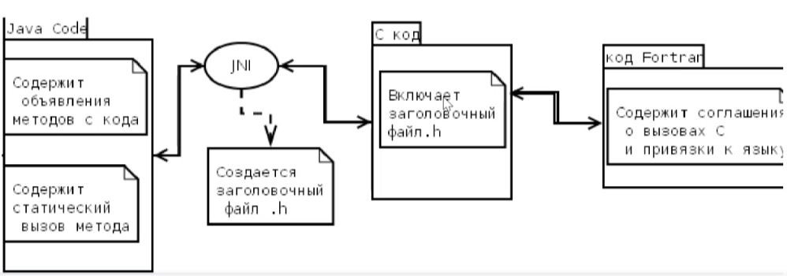
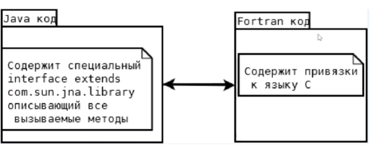
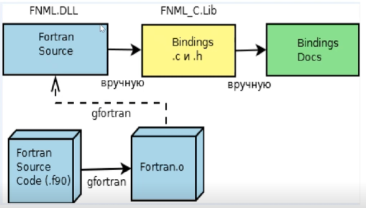
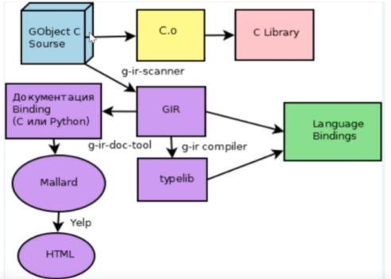
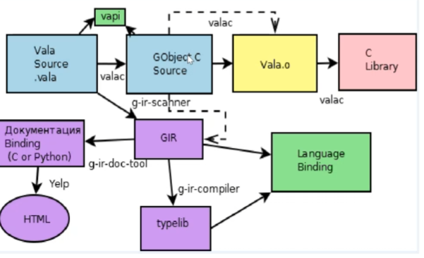

# Лекция 1

Дата: 04.09

---

## Системные методы оптимизации

Основная тема – работа над оптимизацией машинного кода.

Одна из главных проблем оптимизации – разделение памяти по разным устройствам:

- СОЗУ – кэш-память процессора, обращаться быстрее всего, но небольшой объем памяти;
- ОЗУ – обращение идет дольше, но объем памяти больше.

Архитектуры современных процессоров соответствуют архитектуре Фон-Неймана (процессор берет данные и команды
непосредственно из его кэша, но большая часть данных для работы процессора получается из ОЗУ по шине данных).

Оперативная память хоть и является довольно быстрой (быстрее, чем получение данных с внешних интерфейсов), т.к. работает
на частоте шины данных процессора, однако обращение по этой шине данных занимает значительное время (большее, чем
непосредственный доступ к данным кэша процессора). При этом ОЗУ может быть довольно большой по объему (максимум 2^34GB
на 64-битных системах).

Доступ к кэшу процессора занимает меньше времени, т.к. он находится на одном кристалле с процессором и не требует
обращения по шине данных. Однако память кэша сильно ограничена (1 уровень – $\leq$ 128 KB, 2 уровень – 1-2 МB, 3 уровень
– $\leq$ 24 MB).

Соответственно одним из способов оптимизации программы – уменьшение объема ее машинного кода с целью попытаться
полностью разместить все ее символы в памяти процессора и свести на нет обращение к шине данных.

**Символ** – функция/подпрограмма/переменная/ресурс, доступный в памяти процессора.

Компиляторы могут включать в себя оптимизации разных типов:

- оптимизации под типы приложений (оптимизация размера кода и его времени выполнения, как с ущербом для его размера, так
  и без него);
- процессорные оптимизации (оптимизация под конкретный процессор, диспетчеризация процессов);
- дополнительные оптимизации (оптимизация математических функций, управление точностью float-данных).

**Стандартные уровни оптимизации** – стандарт компиляторов системных оптимизаций. Т.к. реализация оптимизаций у каждого
компилятора может быть захардкожена, выделяют несколько уровней, различных по степени влияния на компилируемый код:

- `Od` (`O0`) – отключение оптимизации, нужно при дебаге приложения, дает доступ к символьной информации (связь
  машинного кода с исходным);
- `Os` – оптимизации для уменьшения объема кода;
- `O1` – допускаются оптимизации, не приводящие к увеличению объема кода (кроме введения inline-функций);
- `O2` – допускаются оптимизации, ускоряющие код и допускающие небольшой (насколько???) прирост объема кода;
- `O3` – high-level optimization, агрессивные методы оптимизации, могут замедлить время компиляции, рекомендуются при
  интенсивном использовании float-вычисления или больших массивов данных;
- `fast` – ~~что-то там про псевдонимы~~, у каждого компилятора оптимизация может включать солянку из вообще чего
  угодно, видимо поэтому этот уровень классифицировать довольно-таки проблемно.

С увеличением уровня оптимизации конечный код будет сильнее отличаться от исходного кода.

В зависимости от типа приложения логично применять определенные уровни оптимизации.

**Inline-функция** – встраиваемые функции/фрагменты кода в точки вызова вместо вынесения ее как отдельный ресурс.
Позволяет увеличить производительность в случаях, где мы можем выйграть за счет встраивания в контекст (не требуется
сохранять стэк вызовов, очищать его, не нужно передавать параметры функции). Например, если функция вызывается в одной и
той же точке множество раз (цикл), то разумно заинлайнить эту функцию. 

# Лекция 2

Дата: 18.09

---

## Процессорные оптимизации

Можно оптимизировать программу под конкретную платформу/инструкции целевого процессора.

Чтобы использовать доступные на процессоре наборы инструкций, их можно указать явно указать при компиляции.

```shell
icl /QxE main.cpp
```

Некоторые компиляторы используют автоматическую диспетчеризацию. Автоматическая диспетчеризация позволяет получить код,
использующий преимущества наборов инструкций, доступных для текущего процессора.

```shell
icl /QaxP main.cpp
```

При этом компилируется 2 версии программы: для платформы **amd-64** и версия, использующую указанный набор инструкций.

Можно оптимизировать точность вычислений при работе с числами с плавающей запятой.

- `-Op` (`-mp` Linux) – строгие вычисления в плавающей запятой **ANSI C** и **IEEE 754** (определяют, как хранится
  вещественное число, сколько бит занимает порядок и мантисса); высокая точность, но медленная работа приложения;
- `-Za` (`-ansi` Linux) – еще более высокая точность и еще более медленная работа приложения
- `-Qlong_double` (Intel EM64T) – изменяет размер чисел типа `long double` с 64 до 80;
- `-Qprec_div` (`-prec_div` Linux) – преобразовывает операцию деления в обратный оператор умножения; снижает точность,
  но увеличивает быстродействие
- `Qpc[32|64|80]` (`-pc[32|64|80]` Linux) – указывает размер для всех типов переменных.

Встроенные методы оптимизации в каждой IDE может отличаться.

Можно заменить стандартные математические библиотеки на сторонние, позволяют увеличить быстродействие за счет, например,
векторизации.

### Высокоуровневые оптимизации

Пример - loop unrolling

```c++
for (int i = 1; i < 1000; i++) {
    y[i] = y[i] + a * x[i];
}
```

Если процессор поддерживает **ldfp** (load floating-point pair), можно оптимизировать код следующим образом:

```c++
for (int i = 1; i < 1000; i+=2) {
    y[i] = y[i] + a * x[i];
    y[i+1] = y[i+1] + a * x[i+1];
}
```

Подобные оптимизации применяются при использовании 3 уровня оптимизации компилятором.

### Межпроцедурная оптимизация

В рамках одного файла может быть несколько функций, вызывающих друг друга,

```c++
void main() {
    for (int i = 1; i < 1000; i+=2) {
        x(i);
    }
}

void x(int i) {
    cout << i;
}
```

Можно применить оптимизацию sub-expression elimination (подробнее об inline-функциях
см. в [лекции 1](lecture-1.md)):

```c++
void main() {
    for (int i = 1; i < 1000; i+=2) {
        x(i);
    }
}

__attribute__((const)) void x(int i) {
    cout << i;
}
```

Аттрибуты могут быть:

- `pure` – функция не изменяет глобальные переменные кроме возврата значений; возвращаемое значение
  зависит от значений аргументов функции;
- `const` – функция не имеет доступа к глобальным переменным, может работать только с аргументами; в основном
  используется для оптимизаций **sub-expression elimination** и **loop optimization**.

Также можно применять оптимизации по отношению к функциям, расположенным в разных файлах.

Процесс компиляции при межпроцедурной оптимизации нескольких файлов

1. первичная компиляция с генерацией o-файлов с информацией об использовании функций друг другом
2. компоновка с межпроцедурной оптимизацией

Стоит указывать больше мета-информации компилятору, чтобы избежать излишней агрессивной оптимизации.

### Profile-guided оптимизация

Использует профилирование для сбора более подробной информации, используемой для дальнейшей оптимизации.

Для профилирования используется инструментальная компиляция приложения для взаимодействия с профайлером.

При помощи профайлера можно собрать профиль приложения с информацией о хотспотах, диапазонах значений переменных и т.д.

На основе данного профиля компилятор сможет более корректно выбрать оптимизации, способствующие увеличению качеств
приложения, и скомпилировать приложение, оптимально работающие в тех же условиях, что было запущено профилируемое
приложение.

Если при профилировании запустить приложение на нерелевантных данных, соответственно могут быть применены оптимизации,
ухудшающие качества приложения на рабочих данных.

Основной issue, который может произойти, это утечка памяти.

# Лекция 3

Дата: 02.10

---

## Показатели качества кода

### Пользовательские метрики

Производительность кода (Perf); 1/T (T - время работы участка кода); количественный показатель.

Потребляемая память (Mem); количественный показатель.

Поддержка современных микроархитектур; качественный показатель.

### Метрики разработчика

Сложность кода (Compl); можно измерять число строк кода (LOC) или цикломатическую сложность (Cycl).

Цикломатическая сложность - количество независимых трасс в программе.

### Эффективность кода

Является интегральным показателем; относится и к пользователю и разработчику.

Измеряется как $Perf / Compl = 1 / (T * Compl)$.

В знаменатель можно добавить метрику

- Mem
- время выхода на рынок (time to market)
- стоимость разработки

Высоко-эффективные технологии - технологии, направленные на повышение эффективности кода, а не только его
производительность.

Примеры:

- Fortran 2018 (ISO)
- Chapel (Cray)
- X10 (IBM)

## Эффективность процессора

- Производительность Perf (perfomance)
- Рассеиваемая мощность TDP (Thermal design power)
- Эффективность Prod (productivity)

Prod = Perf / TDP

В знаменатель можно добавлять:

- стоимость
- оказание влияние на окружающую среду при разработке и эксплуатации

## Эволюция архитектур

Тенденции:

- Опыт векторных процессоров
- Размер расширенных регистров

### Single core

Процессоры стали со временем векторными (ядро обладает АЛУ и FPU)

### Hyperthreading

Гиперпоточность - технология Intel для повышения производительности процессоров.

В процессоре, поддерживающем гиперпоточность, вычислительное ядро может хранить состояние сразу двух потоков выполнения,
содержит по 2 набора регистров. При выполнении задачи и возникновения кэш-промаха (нужно прочитать данные), ядро
переключается на выполнение другой задачи, переключившись на другой набор регистров.

### Dual core

Размещение 2х на кристале одного устройства.

### Multi core

Ядер на кристалле стало больше.

### Many core

Ядра теперь могут быть специализированным (могут специализировать на выполнении особого алгоритма, например H.264)

## Расширенные наборы инструкций

Компилятор может задействовать дополнительные наборы функций в зависимости от их наличия.





### MMX

- 64 бита
- lfpp (Itanium): 64 бита — 2 числа с плавающей запятой
- поддерживающие процессоры:
    - семейство Intel Pentium 5 (MMX)

### 3DNow!

- 64 бита — 2 числа с плавающей запятой
- поддержка кэша 3 уровня
- Поддерживающие процессоры:
    - семейства AMD K6-2, K6-3 (3DNow!)
    - National Semiconductor Geode (позже AMD Geode)
    - семейства VIA C3 (Cyrix III) "Samuel", "Samuel 2" "Ezra", "Eden ESP"
    - IDT Winchip 2

### SSE

- 64 бита — 2 числа с плавающей запятой
- Поддерживающие процессоры:
    - семейства Pentium 6

### SSE2

- 64 бита — 2 числа с плавающей запятой
- Поддерживающие процессоры:
    - Intel NetBurst-based CPUs (Pentium 4, Xeon, Celeron, Pentium D, Celeron D)
    - Intel Pentium M and Celeron M
    - Intel Atom
    - Transmeta Efficeon
    - VIA C7

### SSE3

- 64 бита — 2 числа с плавающей запятой
- Поддерживающие процессоры:
    - AMD:
        - Athlon 64, 64 X2, 64 FX, II
        - Opteron, Sempron
        - Phenom, Phenom II
        - Turion 64, 64 X2, X2 Ultra, II X2 Mobile, II X2 Ultra
        - APU
        - FX Series
    - Intel:
        - Celeron D, Celeron
        - Pentium 4, D, Extreme Edition, Dual-Core
        - Core
        - Xeon
        - Atom
    - VIA/Centaur:
        - C7
        - Nano
        - Transmeta Efficeon TM88xx (NOT Model Numbers TM86xx)

### SSE4

- 128 бит — 4 числа с плавающей запятой
- Поддерживающие процессоры:
    - Intel
        - Penryn, Nehalem, Silvermont
        - Haswell
    - AMD
        - Barcelona
        - Bulldozer
        - Bobcat
        - Jaguar
    - VIA
        - Nano

### AVX

- 256 бит — 8 чисел с плавающей запятой
- Поддерживающие процессоры:
    - Intel
        - Sandy Bridge, E
        - Ivy Bridge, E
        - Haswell, E
        - Broadwell, E
    - AMD:
        - Bulldozer
        - Piledriver
        - Steamroller
        - Excavator
        - Jaguar
        - Puma

### AVX2

- 256 бит — 8 чисел с плавающей запятой
- Поддерживающие процессоры:
    - Intel
        - Haswell (Q2 2013), E (Q3 2014)
        - Broadwell (Q4 2014), Broadwell E (2015)
        - Skylake (2015)
        - Cannonlake (2017)
    - AMD
        - Excavator (2015)

### AVX-512

- 512 бит — 16 чисел с плавающей запятой
- Поддерживающие процессоры:
    - Intel
        - Knights Landing Xeon Phi (2015)
        - Skylake Xeon (2016)
        - Cannonlake Xeon (2017)

## Векторизация

Ранее ранее использовалась архитектура SISD (Single Instruction, Single Data), подразумевающая выполнения процессором
одного потока команд.

Для повышения производительности в ядра стали вводить векторные АЛУ и векторные вычислители с плавающей запятой (FPU).

Данная архитектура стала называться SIMD (Single Instruction, Multiple Data), соответственно архитектура процессоров с
множеством ядер такой архитектуры стали называться MIMD (Multiple Instruction, Multiple Data).



Если увеличить регистровый файл, а на кристалле есть векторное АЛУ/FPU, на вход можно передавать несколько входов, что
позволит выполнять одну и ту же операцию над множеством данных. Это есть SIMD/векторизация.

Векторизация позволяет увеличить производительность без увеличения частоты процессора.

Пример:



Компилятор задействуется все 4 арифметико-логические устройства процессора, складывая не отдельные значения, а векторы
значений. При скалярном коде пришлось бы делать 4 операции сложения последовательно.

Перед векторизацией выстраиваются данные (marshaling) с целью сделать оба операнда векторными. Затем задействуется
векторное АЛУ/FPU. Результат помещается в векторный регистр, откуда попадает в оперативную память.

Векторизацию невозможно применить к операциям, если результат одной операции зависит от результата другой.

Компилятор может векторизовать код, указав

- 3 уровень оптимизации
- целевую платформу

### Перекрытие кода

В C++ есть псевдонимы, которые позволяют указывать на другие объекты (например элементы массива). Если переменные имеют
общие данные, это называется перекрытие по данным (memory overlapping).

Модификатор `restrict` означает, что разработчиком гарантируется перекрытие по памяти. Может вызывать ошибки, если
забыть учесть подобные моменты.

Для гарантии эксклюзивности данных можно использовать умные указатели (`auto`, `unique`).

Также компилятор может делать 2 версии участка кода: с без векторизации и с векторизацией. На первой он проверяет, может
ли быть перекрытие по данным.

# Лекция 4

Дата: 30.10

---

## УсПеШнАя ВеКтОрИзАцИя

Пример:

```c++
B(2:N) => A(1:N-1)
```

- `B(i) == A(i-1)`
- `B(2) == A(1)`
- `B(3) == A(2)`
- перекрытие по памяти у `A` и `B`

УсПеШнАя ВеКтОрИзАцИя может быть осуществлена даже с перекрытием по памяти:

```c++
void foo(float *a, float *b, float *c) {
    for (int i = 0; i < n; i++) {
        a[i] = a[i] + b[i] + c[i];
    }
}
```

Данный код компилируется дважды:

1. с инструкциями AMD64 (2000 года)
2. с инструкциями AMD64 и расширенным набором инструкций (указываются пользователем)

Перед циклом порождается код **автоматической диспетчеризации**, который смотрит по адресам и размеру типа, есть ли
перекрытие по памяти. Если есть, то используется вариант только с инструкциями AMD64.

Однако в прод идет оба варианта, соответственно сам объем исполняемого кода возрастает, что также сказывается и на
быстродействии.

Чтобы более грамотно указывать на возможное перекрытие по памяти, в языках встречаются специальные конструкции
(например `target` в c++). Также в том же c++ есть возможность автоматического расположения объектов в памяти,
что гарантирует их уникальность и отсутствие перекрытий по памяти.

В C99 было ключевое слово `restrict`, с помощью которого программист мог сообщать, что для объекта нет перекрытия по
памяти. На самом деле нет никакой гарантии в этом, поэтому это не самый надежный способ предотвращения перекрытий.

Некоторые компиляторы могут выводить, что им удалось векторизовать, а что нет (и по какой причине).

### Регулярный доступ к памяти

Для успешной векторизации перебора многомерных массивов их нужно выстраивать таким образом, чтобы в качестве первого
индекса при адресации указывался наиболее часто изменяемый, а последним, соответственно, изменяемый реже всего.

```c++
for (int i = 0; i < itmax; i++) {
    for (int j = 0; j < n; j++) {
        for (int k = 0; k < n; k++) {
            for (int l = 0; l < n; l++) {
                c[l][j] = c[l][j] + a[l][k] * b[k][j];
            }
        }
    }
}
```

Это обеспечит более грамотное развертывание массива, и замаппить его в памяти:


### Векторизация циклов

Не любой кортеж элементов массива может быть векторизирован из-за схемотехнических ограничений, т.к. физический адрес
должен по-хорошему делиться на размер страницы памяти процессора.

В векторизации могут участвовать только элементы, выровненные по адресу (например на 16 байтов, зависит от характеристик
процессора).


Таким образом цикл делится на 3 части (длины неизвестны на этапе компиляции):

1. Peel loop, prologue - обрабатывается только с использованием инструкций AMD64, нужен для выравнивания адреса 2 части;
2. Main loop, векторная часть цикла - обрабатывается с использованием векторных инструкций;
3. Remainder loop, tail loop, epilogue - обрабатывается только с использованием инструкций AMD64, является остатком
   после выравнивания.

В идеале нужно сразу выравнивать данные.

### Различия по типам данных

Все операции типа сложения измеряются в процессорных циклах.

На этом можно сыграть.

Например, есть массив из 26 `int`. Без векторизации проход по нему будет происходить за 26 циклов.

При применении векторизации можно совершить проход за время от 8 до 11 циклов (в зависимости от того, где расположить в
памяти массив, и будут ли peel loop или remainder loop для выравнивания).

Однако, если элементов массивов 28 (число кратное 4), то можно сократить это время до 7 циклов, т.к. весь массив можно
расположить в памяти так, чтобы векторизировать его полностью.

### Способы выравнивания

В c++ есть множество конструкций для конфигурирования выравнивания:

- `_mm_malloc`
- `posix_memalign`
- `__declspec`

Также есть конструкции для сообщения компилятору, что данные выравнены:

- `#pragma vector aligned`
- `__assume_aligned`

### Блочная работа с СОЗУ

```c++
for (int i = 0; i < n; i++) {
    for (int j = 0; j < m; j++) {
        c += a[i] * b[j];
    }
}
```

Алгоритмическая сложность данного кода равен O(n*m).

Чтобы ее уменьшить, можно поработать с блочной памятью, разбив массив на блоки:

```c++
for (int jout = 0; jout < m; jout += block) {
   for (int i = 0; i < n; i++) {
       for (int j = jout; j < jout + block; j++) {
           c += a[i] * b[j];
       }
   }
}
```

Из-за того, что чтение может осуществляться блоками, можно вычитывать не по количеству элементов, а по количеству
блоков, объединяющих элементы в количестве, которое позволяет хранить в себе СОЗУ. Таким образом алгоритмическая
сложность кода становится ниже:

O(m / block * (n + block)) = O(m * n / block + m)

### Условия векторизации

- данные должны быть сплошными
- должен быть обеспечен регулярный доступ к памяти
- первый элемент вектора должен быть выровнен
- не должно быть перекрытий по памяти
- не должно быть зависимостей итераций типа чтения после записи

# Лекция 5

Дата: 13.11

---

## Проблемы при высокопроизводительных вычислениях

### Стены памяти


На данный момент CPU и RAM являются отдельным устройствами.

При обращении к данным происходит кэш-промах, требуется обратиться к оперативной памяти и получить эти данные, из-за
чего требуется больше тактов на выполнение операции.


Статистика показывает, что разница в пропускной способности памяти и процессора монотонно растёт (красная линия)

Решения:

- 3D-память
- анализ ПВЛ (пространственно временная локализация) R/W операций
- асинхронные R/W с использованием легковесных потоков

### Пространственно-временная локализация обращений в память


На рисунке приведены профили 2 разных приложений.

На профиле слева последовательно идет обращение к несоседним адресам.

На профиле справа последовательно происходит обращение к соседним адресам.


Можно разместить большой объём данных в ОЗУ, нарезав их на блоки длиной L, и осуществить перебор блоков с определённым
смещением. Таким образом можно локализировать данные и обращаться от операции к операции только по соседним адресам.

Данный способ будет не эффективен, если размер блока L = 1 (ничем не отличается от обращения к несоседним адресам).


### Временная локализация

Временная локализация позволяет оптимизировать программу за счет выявления адресов, к которым наиболее часто происходит
обращение.

Временная локальность моделируется номерами блоков


### Профиль перемножения матриц

Профиль перемножения матриц - своего рода статистика, позволяющая определить прирост производительности благодаря
локализациям.


### Тест APEX-map

Тест APEX-map - карта локализации. На ней можно определить точки, в которых эффективно работает та или иная локализация.


- L - хорошая временная и пространственная локальности
- F - хорошая временная локальность и плохая пространственная (размер блока равен 1)
- T - плохая временная локальность (нас не интересуют одни и те же данные несколько раз) и хорошая пространственная (
  имеют большой размер блока)
- G - плохая временная и пространственная локальности

### Увеличение потока обращений процессора к памяти

Можно обеспечить многофазность операций ввода-вывода для порождения множества параллельных обращений к памяти

- выставление чтения (read issue)
- передача (yield)
- завершение чтения (read complete)

### Метод многофазного чтения

Реализация механизма многофазного чтения - через легковесные потоки, не требующие переключения контекста процессора.

Это не поток (threads) в терминах POSIX, ни задачи ядра Linux (tasks).

Один из методов введения легковесных потоков - применение сопрограмм (coroutines).

# Лекция 6

Дата: 27.11

---

### Метод многофазного чтения

- Реализация чтения через легковесные потоки (не нужно переключение контекста)
- Реализация, например, через корутины

### Проблемы сложности параллельного кода

Гетерогенная архитектура - архитектура, при которой один из вычислителей не является универсальным ядром (FPGA, ASIC,
т.д.)

Высокопроизводительные вычисления (HPCS):

- Соревнование между компаниями
    - IBM - PERCS
    - SUN - Fortress
    - Cray (Cascade, Chapel, Lustre)
    - Иногда относят Fortran

### Проблемы надёжности

- Больше ядер - более выгодно энергетически
- Больше ядер - меньше надёжность:
    - P1 = 0.999999
    - P100 = 0.9999
    - P1000 = 0.999
    - P1000000 = 0.367879
    - ...
- Решение - изменить парадигму
    - Дублирование/системы контроля результатов(мажоритарное голосование/т.д.)?
    - Fuzzy logic, как в природе (часть вычислений - со сбоями, это известно)?

Распределённые вычисления могут использоваться на добровольной основе.

При нахождении новой компонентной базы:

- Число вычислителей сократится (лучше качество ПО, дешевле электроника)
- Число вычислителей то же (сильный скачок в производительности)

### Введение в многоязыковое программирование

MLP - процесс разработки ПО, при котором код написан на 2+ языках программирования.

Используется при совмещении задач:

- В системном программировании (ОС/драйвер/компоненты систем программирования/т.д.) (С/С++/Rust)
- При параллельной обработке данных (векторизация, регулярное программирование) (fortran)
- Фронтэнд (время выхода на рынок, привлечение непрограммистов - e.g. граф.дизайнеров) (Javascript)
- Вычисления с ПЗ (точность, скорость работы) (C, Fortran)
- Встраиваемые системы (системы реального времени, авионика, космонавтика - высокая цена ошибки) (ADA, C++ с
  ограничениями)
- Поддержка корпоративной инфраструктуры (Java)
- Работа с сетью (~=системное ПО)

При использовании MLP возможно использование унаследованного кода.

Двоичный интерфейс приложений (ABI) - набор соглашений для доступа к ОС и к архитектуре набора команд.

Embedded ABI - набор ABI для использования во встраиваемых системах.

Компилятор, поддерживающий ABI, в результате компоновки может создать объектный файл А, который будет компоноваться
всеми компоновщиками, поддерживающими тот же ABI.

ABI определяет:

- Форматы файлов(текстовый, архив, двоичный, т.д.)
- Работа с ресурсами (e.g. стек)
- Соглашение о вызове
- Соглашения по именам
- Pass by value/reference/reference+protection
- Эквивалентные типы данных/структур

# Лекция 7

Дата: 12.12

---

### Способы вызова процедур из головной диаграммы

#### Управляемый код

Управляемый код является архитектурно независимым, выполняется он под управлением среды (виртуальная машина).

Примеры:

- Common Language Runtime Environment (CLR), среда выполнения языка .NET
- Java Virtual Machine байт-код
- Виртуальная машина Dalvik

#### Неуправляемый код

Неуправляемый код (native) является архитектурно зависимым, компилируется под определенную систему.

### Оформление кода для запуска символов

- Скомпилированные объектные файлы (`.obj`) и статические библиотеки (`.lib`)
    - Преимущества:
        - Наибольшая производительность
        - Простота использования в IDE
    - Недостатки:
        - должны быть совместимы на этапе компоновки
        - не должны иметь имена, конфликтующие с именами стандартных библиотек
- Динамически подключаемая библиотека (.dll)
    - Преимущества:
        - Эффективность собственного кода
        - Доступность в большинстве языков
        - Обычно не создают конфликтов со стандартными библиотеками
    - Недостатки:
        - Использование в некоторых языках осложнено
- Сборка управляемого кода .NET
    - Преимущества:
        - теоретически архитектурно независимая среда реального времени
        - может вызывать неуправляемый код внутри DLL
    - Недостатки:
        - производительность сборки намного ниже
        - ограниченный набор языков
        - более сложный интерфейс при вызове неуправляемого кода

### Эквиваленты языков при обращении к процедурам

| Язык      | Вызов с возвращаемым значением | Вызов без возвращаемого значения |
|-----------|--------------------------------|----------------------------------|
| Fortran   | Function                       | Subroutine                       |
| C         | Function                       | void function                    |
| C++       | Function                       | void function                    |
| C#        | Function                       | void function                    |
| Basic     | Function                       | Sub                              |
| Pascal    | Function                       | Procedure                        |
| Delphi    | Function                       | Procedure                        |
| Assembler | Procedure                      | Procedure                        |

### Начальное значение индекса массива

| Язык              | По умолчанию | Может быть |
|-------------------|--------------|------------|
| C                 | 0            | 0          |
| C++               | 0            | 0          |
| C#                | 0            | 0          |
| Visual Basic .NET | 0            | 0          |
| JavaScript        | 0            | 0          |
| Visual Basic 6.0  | 0            | Any        |
| Fortran           | 1            | Any        |
| Pascal            | 1            | Any        |
| Delphi            | 1            | Any        |

### Развертывание массивов в памяти

| Язык              | Порядок     |
|-------------------|-------------|
| C                 | По строкам  |
| C++               | По строкам  |
| C#                | По строкам  |
| Visual Basic .NET | По строкам  |
| JavaScript        | По строкам  |
| Visual Basic 6.0  | По столбцам |
| VBScript          | По столбцам |
| Fortran           | По столбцам |
| Pascal            | По строкам  |
| Delphi            | По строкам  |

### Развертывание массивов по столбцам



### JNI

JNI позволяет использовать C++ нативный код в Java-коде



Соотношение типов:

| Собственный тип | Тип Java | Описание         |
|-----------------|----------|------------------|
| unsigned char   | jboolean | unsigned 8 bits  |
| signed char     | jbyte    | signed 8 bits    |
| unsigned short  | jchar    | unsigned 16 bits |
| short           | jshort   | signed 16 bits   |
| long            | jint     | signed 32 bits   |
| long long_int64 | jlong    | signed 64 bits   |
| float           | jfloat   | 32 bits          |
| double          | jdouble  | 64 bits          |
| void            |          |                  |

Ошибки в JNI могут сильно дестабилизировать виртуальную машину.

При использовании нативных библиотек пропадает кроссплатформенность.

Garbage Collector не работает с другими языковыми технологиями.

### Межязыковое взаимодействие на основе JNA

Позволяет ПО на Java вызывать собственные динамические библиотеки без использования JNI. При этом доступ к ним
осуществляется с минимальными затратами.

JNA не требует шаблонного или вспомогательного кода.

Под капотом используется библиотека foreign function interface library (libffi) для динамического вызова собственных
методов.



У JNI (как и у JNA) есть недостаток: при вызове символа из C-кода потребуется привязка при помощи заголовочного файла,
которые требуется писать вручную для компилятора.



### Методика межъязыкового взаимодействия на основе GIR



GIR - сканер, анализирующий код, и представляющий подробное описание всех символов, а также документирует их. Позволяет
автоматически создавать привязки.

ОДнако данный метод подразумевает некоторые сложности:

- Требуется написание исходного кода в терминах GObject C, что приводит к увеличению объема исходного кода
- Изменение библиотек вызывает последующее изменение привязок
- Ручная работа может генерировать больше ошибок

### Методика межъязыкового взаимодействия на основе VALA


